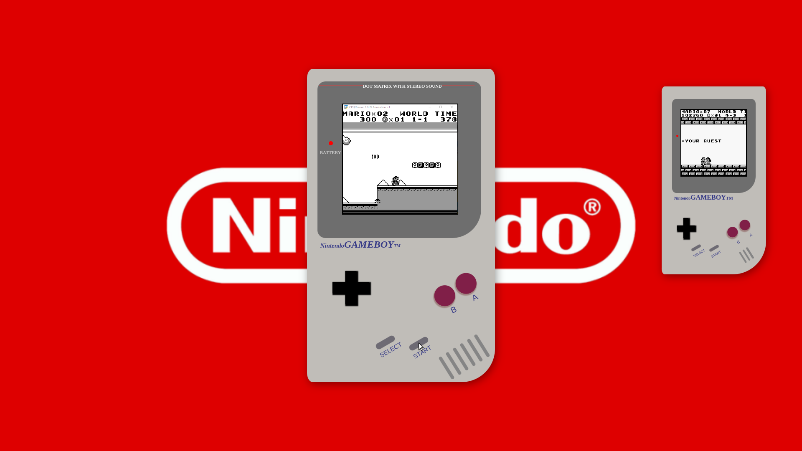
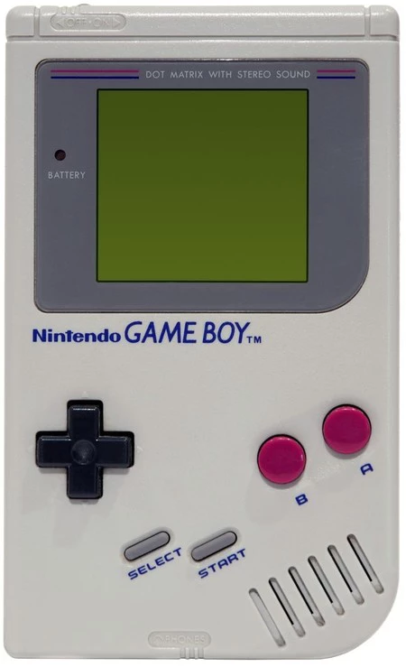

# Proyecto 1 - Videoconsola con CSS

## Tabla de contenidos
- [Cómo funciona](#cómo-funciona)
- [Referencias](#referencias)
- [Desarrollo](#desarrollo)
- [Errores conocidos](#errores-conocidos)
- [Licencia y Copyright](#licencia-y-copyright)

---

#### Cómo funciona
Estas réplicas de la videoconsola portátil Nintendo Game Boy pueden ejecutarse desde el navegador web y son capaces de realizar varias acciones:
- Pulsando el botón START en ambas consolas, se muestra en la pantalla una animación de Super Mario Bros., se ilumina el piloto LED junto al símbolo POWER y se reproduce música de fondo.

El modelo y todos los detalles incluidos están basados en la videoconsola portátil Nintendo Game Boy, lanzada al mercado en Japón en 1989.

---

#### Referencias 
Me he inspirado en esta imagen.

---

#### Desarrollo
En el desarrollo de la videoconsola se ha empleado HTML y CSS, con algunos elementos de JavaScript.
El cuerpo de la consola está construido utilizando `display: grid`, dividiendo así los elementos principales.
Todos los elementos están creados desde cero con HTML y CSS.

---

#### Errores conocidos
Aunque no se trata de un error que impida el buen funcionamiento de la maqueta, al pulsar el botón START se enciende la luz POWER, se inicia un GIF y música, pero no se ha definido la acción para desactivarlos.

---

#### Licencia y Copyright
Game Boy es propiedad de Nintendo Co., Ltd.